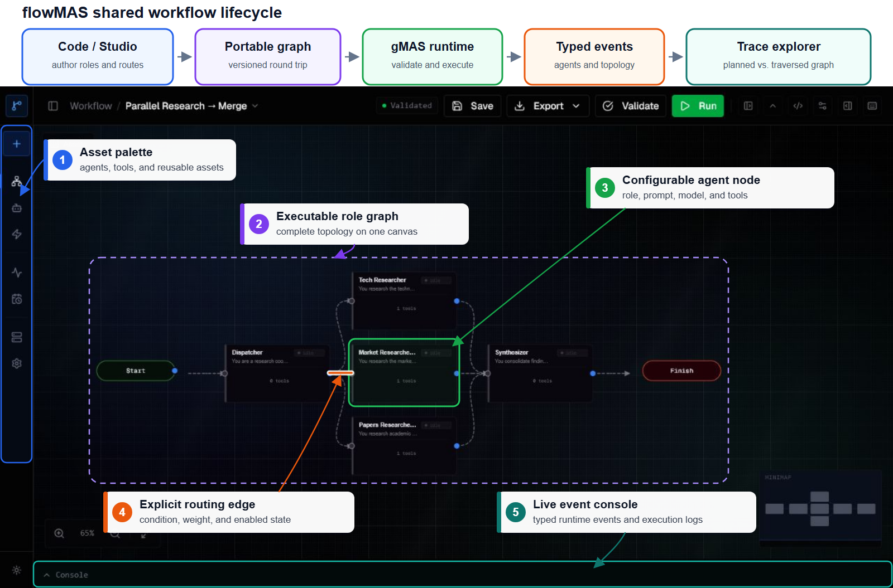

# flowMAS

Graph-native web studio, demo API, and self-hosted observability for mutable
multi-agent workflows powered by **gMAS**.

[](https://github.com/frontier-ai-next/flowMAS/actions/workflows/ci.yml)

[Live demo](https://gmas.frontierai.ru/) ·
[Core gMAS SDK](https://github.com/frontier-ai-next/gMAS) ·
[Evaluation](docs/EVALUATION.md) ·
[MIT license](LICENSE)



- **Workflow studio** — visual graph editor: agents, edges, conditions, execution-order preview
- **Run monitoring** — live timeline, tools, tokens, events, topology changes
- **Configure** — LLM providers, tools, runner config, routing policy, topology hooks
- **Observe** — run history, metrics, diagnostics, error output

The gMAS SDK core lives in a **separate repository**
([`frontier-ai-next/gMAS`](https://github.com/frontier-ai-next/gMAS)) and is
vendored here as a git **submodule** at `vendor/gmas`. This repository contains
the studio, API, and observability integration; it consumes the core without
modifying it.

```
flowMAS/
├── apps/
│   ├── web/     # React 19 + Vite — landing + studio
│   ├── api/     # FastAPI backend (imports `gmas`)
│   ├── observability/ # standalone ingestion/query service + trace explorer
│   └── deploy/  # nginx + container entrypoint
├── packages/
│   └── gmas-observability/ # reusable Python SDK and gMAS callback adapter
└── vendor/
    └── gmas/    # ← git submodule → gMAS SDK core (read-only here)
```

---

## Evaluation snapshot

The current evaluation covers **68 matched model-dataset-topology
configurations** on BBH, GSM8K, and MMLU-Pro. Against matched LangGraph runtime
graphs, observed latency changed by topology:

| Topology | Latency vs. LangGraph | Tokens vs. LangGraph | Accuracy delta |
|---|---:|---:|---:|
| Single agent | -4.0% | -1.5% | +0.0 pp |
| Three-agent chain | +1.0% | +3.1% | +2.5 pp |
| Fan-in | -8.0% | +1.7% | +3.0 pp |
| Fan-out | -9.3% | -0.1% | +2.9 pp |

Runtime controls produced the largest savings when they avoided unnecessary
model calls. In the evaluated ablations, early stopping reduced tokens by
**52.6%** and latency by **45.0%**; the adaptive policy reduced tokens by
**21.2%** and latency by **18.5%**.

A separate local studio-path benchmark used six paired synthetic workflows.
gMAS compilation remained below **2 ms**, and gMAS delivered the first streamed
output earlier in all six observed scenarios. These measurements are scoped
engineering results, not a claim that every workflow is faster or cheaper.
See [Evaluation](docs/EVALUATION.md) for the protocol, complete tables, and
limitations.

---

## Cloning (read this — submodule)

```bash
# fresh clone — pulls the SDK submodule too
git clone --recurse-submodules https://github.com/frontier-ai-next/flowMAS.git

# already cloned without --recurse-submodules:
git submodule update --init --recursive
```

> If `vendor/gmas/` is empty, you forgot the submodule — run the second command.

---

## Local development

Requirements: **Python 3.12 or 3.13**, **pnpm** (or npm), git submodule `vendor/gmas`.

From the repo root:

```bash
git submodule update --init --recursive
./scripts/dev-up.sh
```

This starts the web studio, API, and standalone observability service. Run a
workflow in the studio, open **Runs**, then select **Trace Explorer**.

The dev script creates `.venv` with Python 3.12+, installs `vendor/gmas`, the
observability SDK, observability server and `apps/api`, then starts API, Vite
and Trace Explorer. Stop all three services with `Ctrl+C` in the terminal that
runs the script.

Manual setup (optional):

```bash
python3.12 -m venv .venv
source .venv/bin/activate
uv pip install -e vendor/gmas -e packages/gmas-observability -e apps/observability -e apps/api
cd apps/web && pnpm install && pnpm dev
# in another terminal:
cd apps/api && uvicorn backend.main:app --reload --port 8000
# in another terminal, from the repo root:
uvicorn backend.main:app --app-dir apps/observability --reload --port 8100
```

Services:

- Web: `http://localhost:3000`
- API: `http://localhost:8000`
- API docs: `http://localhost:8000/docs`
- Observability / Trace Explorer: `http://localhost:8100`

See [Observability architecture and integration](docs/OBSERVABILITY.md) for the
event model, deployment options, privacy controls and current product scope.

### Anonymous workspaces (no login)

Each browser receives a stable **`gmas_session` HttpOnly cookie** on first visit. Graphs, agents, runs, schedules, and settings are stored under `data/sessions/{session_id}/` and are invisible to other browsers. Clearing cookies starts a fresh workspace. Set `GMAS_SESSION_COOKIE_SECURE=true` behind HTTPS in production.

### Langflow vs gMAS benchmark

Compare health, validate/import, execution latency, tokens and observability traces
via API. Supports multiple **scenarios** (architectures), repeats, and CSV export.

```bash
cp scripts/benchmark.config.example.json scripts/benchmark.config.json

# health + validate only
.venv/bin/python scripts/benchmark_langflow_vs_gmas.py \
  --config scripts/benchmark.config.json --dry-run

# all enabled scenarios (see scenarios[] in config)
.venv/bin/python scripts/benchmark_langflow_vs_gmas.py \
  --config scripts/benchmark.config.json

# one scenario
.venv/bin/python scripts/benchmark_langflow_vs_gmas.py \
  --config scripts/benchmark.config.json --scenario single_llm
```

Reports: `benchmarks/reports/` as JSON + Markdown + **CSV** (one row per run).

Metrics include graph structure (agents/edges/tools/schemas), **compile/validate** timing
(`POST /graphs/{id}/validate` runs `GraphBuilder.build()`), runtime breakdown
(`compile_setup_ms`, `agent_llm_ms_sum`, `orchestration_overhead_ms`, `poll_wait_ms`,
`time_to_first_agent_ms`, `agent_gap_ms_mean`, `execution_wall_ms`), WebSocket TTFT
(`measure_stream_ttft` / `measure_ws_ttft`), and design-time API latency
(`list_graphs`, `list_flows`, `history_summary`, `build_flow`, `validate_inline`).

Set `run.measure_design_time: true` (default) and `run.measure_stream_ttft: true` for full flow metrics without output validation.

Scenario fields: `id`, `architecture`, `runs`, `platforms`, per-scenario `langflow` / `gmas` overrides.
Set `run.compile_validate_repeats` (default 1) for cold/warm compile stats.

**Langflow multi-agent flows:** create 2- and 3-LLM chains for head-to-head scenarios:

```bash
.venv/bin/python scripts/setup_langflow_benchmark_flows.py \
  --config scripts/benchmark.config.json --patch-config

# tool-free gMAS graphs from templates
.venv/bin/python scripts/setup_gmas_benchmark_graphs.py --patch-config
```

`gmas.disable_tools: true` (default) strips agent tools and sets `max_tool_iterations: 0` for LLM-only parity with Langflow chains.

Reports include **comparison table** (CSV/MD), **PNG charts**, and an **HTML dashboard** (`*_dashboard.html`).
Regenerate visuals from JSON: `--visualize-only benchmarks/reports/benchmark_….json`

Environment variables (optional overrides): `LANGFLOW_SERVER_URL`, `LANGFLOW_API_KEY`, `FLOW_ID`, `GMAS_API_URL`,
`GMAS_GRAPH_ID`, `GMAS_OBSERVABILITY_URL`, `GMAS_OBSERVABILITY_API_KEY`.

---

## Updating the SDK

The submodule is pinned to a specific gMAS commit. To move it forward:

```bash
cd vendor/gmas
git fetch && git checkout <tag-or-commit>   # e.g. a release tag
cd ../..
git add vendor/gmas
git commit -m "chore: bump gmas submodule to <ref>"
```

---

## Production

```bash
docker compose -f docker-compose.yml -f docker-compose.local.yml up --build
```

Stop the Docker services with:

```bash
docker compose -f docker-compose.yml -f docker-compose.local.yml down
```

Graphs, agents and run history are persisted under `.docker-data/api` on the
host. Observability traces are stored under `.docker-data/observability`.
These directories are ignored by Git and survive container recreation,
`docker compose down -v` and Docker volume pruning. Override their locations
with `GMAS_DATA_PATH` and `GMAS_OBSERVABILITY_DATA_PATH` in `.env`; back them
up separately when the data is important.

LLM provider API keys saved through the UI are encrypted at rest. Set a stable
`GMAS_PROVIDER_SECRET_KEY` in `.env` for production; local Compose generates a
private key inside the persisted API data directory when it is omitted.

Serves the static web build from `apps/web/dist/public`; API + WebSocket proxied to Uvicorn via nginx.

---

## Relationship to gMAS

| | repo | what |
|---|---|---|
| **core SDK** | `gMAS` | graph engine, agents, runner, tools — the framework |
| **this** | `flowMAS` | studio, demo API, and observability on top of the SDK (submodule) |

This repo never modifies `src/gmas` — the core is consumed as-is via the submodule.
